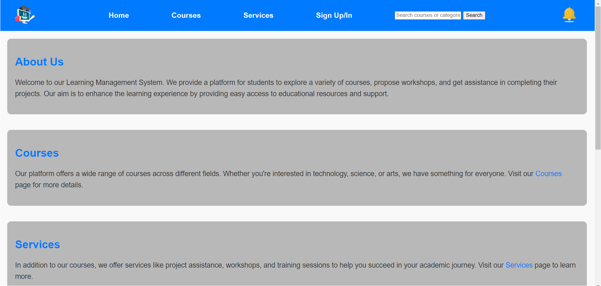

<a name="readme-top"></a>
<div align="center">

[![Contributors][contributors-shield]][contributors-url]
[![Forks][forks-shield]][forks-url]
[![Stargazers][stars-shield]][stars-url]
[![Issues][issues-shield]][issues-url]
[![MIT License][license-shield]][license-url]
[![LinkedIn][linkedin-shield]](https://www.linkedin.com/in/chater-marzougui-342125299/)
</div>

<!-- PROJECT LOGO --> 
<br />
<div align="center">
    <h1 style="font-size:35px">Educational Courses Website</h1>
    <br>
    <p style="font-size:20px" align="center">
        A website for learning web development (HTML, CSS, JavaScript) and more!
    <br>
    <br>
    <a href="https://github.com/chater-marzougui/E-Learning-WebPage/issues/new?labels=bug&template=bug-report---.md">Report Bug</a>
    ·
    <a href="https://github.com/chater-marzougui/E-Learning-WebPage/issues/new?labels=enhancement&template=feature-request---.md">Request Feature</a>
  </p>
  <br><br>
  <a href="https://github.com/chater-marzougui/E-Learning-WebPage">
    
  </a>
</div>

# Educational Courses Website
<!-- TABLE OF CONTENTS -->
<details>
  <summary>Table of Contents</summary>
  <ol>
    <li><a href="#about-the-project">About The Project</a></li>
    <li><a href="#features">Features</a></li>
    <li><a href="#installation">Installation</a></li>
    <li><a href="#contributing">Contributing</a></li>
    <li><a href="#license">License</a></li>
    <li><a href="#contact">Contact</a></li>
  </ol>
</details>

<!-- ABOUT THE PROJECT -->
## About The Project
This **Educational Courses Website** offers a simple and interactive platform where users can learn web development skills through courses on HTML, CSS, and JavaScript. Each course page contains descriptions, tutorial videos, documents, and images to assist the learning process. The site is designed to be intuitive and easy to navigate for learners of all levels.

Additionally, the website features a secure **Firebase authentication** system for user login and registration, and an easy-to-use **contact form** powered by **Elastic Mail** through **SMTP.js** for seamless communication with us.

## Features
- **Course Pages:** Each course has its own page with descriptions, videos, PDFs, and images.
- **Firebase Authentication:** Secure login and registration with Firebase.
- **Login/Signup System:** Secure login to access the course content.
- **Contact Form with Elastic Mail:** Easily reach out using a contact form integrated with Elastic Mail and SMTP.js.
- **Responsive Design:** Works on all devices including mobile and tablet screens.
- **Easy Navigation:** Clear links between courses and reference pages for better learning experience.
- **Engaging Design:** Attractive layout with modern CSS.

<p align="right">(<a href="#readme-top">back to top</a>)</p>

## Installation

1. **Clone this repository** to your local machine:
    ```bash
    git clone https://github.com/chater-marzougui/E-Learning-WebPage.git
    ```
2. **Navigate to the project directory**:
    ```bash
    cd E-Learning-WebPage
    ```
3. **Open `home.html`** in your preferred web browser.

<p align="right">(<a href="#readme-top">back to top</a>)</p>

## Contributing

Contributions are what make the open source community such an amazing place to learn, inspire, and create. Any contributions you make are **greatly appreciated**.

If you have a suggestion that would improve this project, please fork the repo and create a pull request. You can also simply open an issue with the tag "enhancement". 
Don't forget to give the project a star! Thanks again!

1. Fork the Project
2. Create your Feature Branch (`git checkout -b feature/AmazingFeature`)
3. Commit your Changes (`git commit -m 'Add some AmazingFeature'`)
4. Push to the Branch (`git push origin feature/AmazingFeature`)
5. Open a Pull Request

<p align="right">(<a href="#readme-top">back to top</a>)</p>

## License

This project is licensed under the **MIT License** - see the [LICENSE](LICENSE) file for details.

<p align="right">(<a href="#readme-top">back to top</a>)</p>

<!-- CONTACT -->
## Contact

Chater Marzougui - [@Chater-marzougui][linkedin-url] - chater.mrezgui2002@gmail.com <br/>

<p align="right">(<a href="#readme-top">back to top</a>)</p>

<!-- MARKDOWN LINKS & IMAGES -->
[contributors-shield]: https://img.shields.io/github/contributors/chater-marzougui/E-Learning-WebPage.svg?style=for-the-badge
[contributors-url]: https://github.com/chater-marzougui/E-Learning-WebPage/graphs/contributors
[forks-shield]: https://img.shields.io/github/forks/chater-marzougui/E-Learning-WebPage.svg?style=for-the-badge
[forks-url]: https://github.com/chater-marzougui/E-Learning-WebPage/network/members
[stars-shield]: https://img.shields.io/github/stars/chater-marzougui/E-Learning-WebPage.svg?style=for-the-badge
[stars-url]: https://github.com/chater-marzougui/E-Learning-WebPage/stargazers
[issues-shield]: https://img.shields.io/github/issues/chater-marzougui/E-Learning-WebPage.svg?style=for-the-badge
[issues-url]: https://github.com/chater-marzougui/E-Learning-WebPage/issues
[license-shield]: https://img.shields.io/github/license/chater-marzougui/E-Learning-WebPage.svg?style=for-the-badge
[license-url]: https://github.com/chater-marzougui/E-Learning-WebPage/LICENSE
[linkedin-shield]: https://img.shields.io/badge/-LinkedIn-black.svg?style=for-the-badge&logo=linkedin&colorB=555
[linkedin-url]: https://linkedin.com/in/chater-marzougui-342125299
